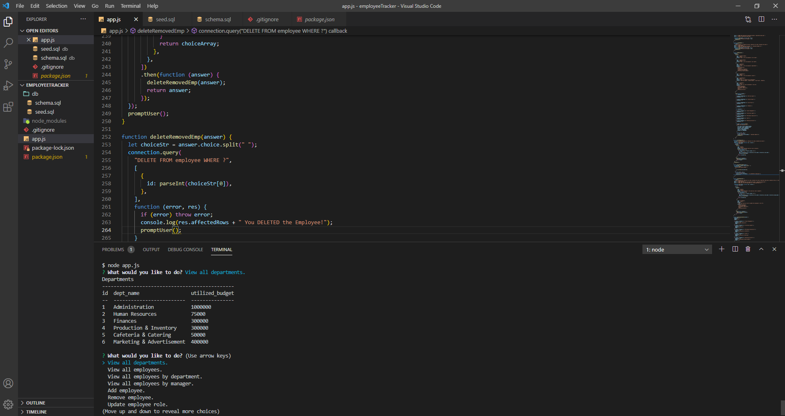
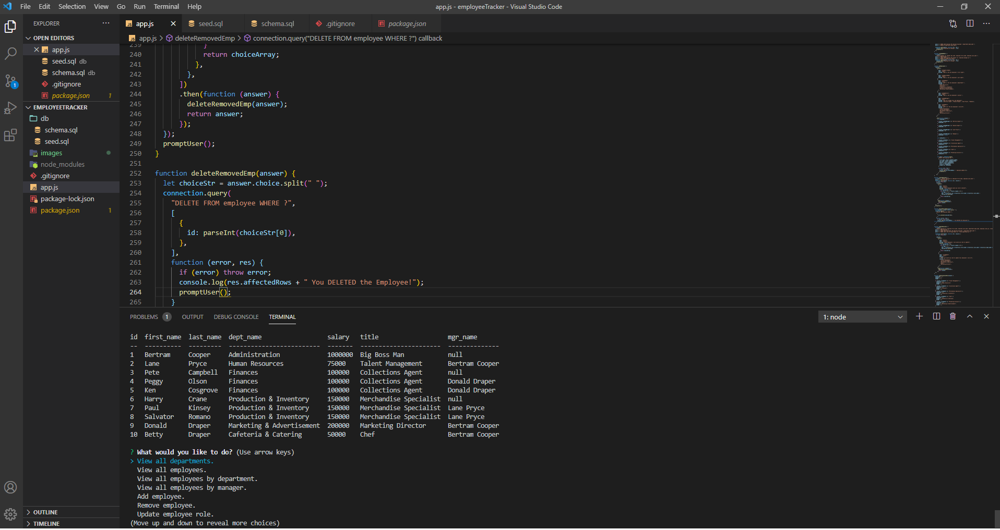

# Employee Tracker

This app uses a MySQL database to track employees of an organization. Users can view all the organization's employees, or view employees by department, or by manager. Users can change an employee's role, add new employees, and delete employees.

